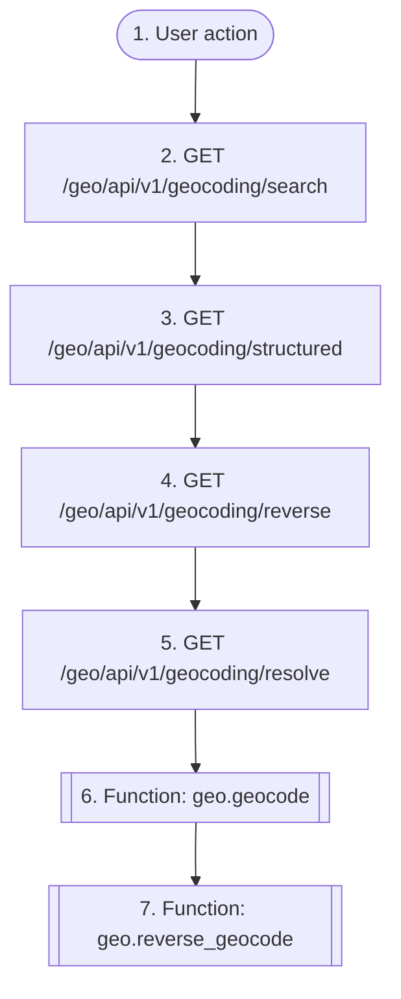

# Geocode an address

`geo.geocode_address`

**Actors:** Authenticated user

A logged-in user turns free text, address components or a coordinate into normalized GeoJSON places through the swappable provider registry (photon by default; nominatim as keyless dev/fallback). Every call is throttled (scope 'geocoding'), cached (GeocodeCache, 30-day TTL) and written to the spend ledger.

## Flow diagram

## Steps

1. **User action** — The user types an address or drops a map pin
2. **GET `/geo/api/v1/geocoding/search`** — Free-text forward geocoding (throttled, cached, ledgered)
3. **GET `/geo/api/v1/geocoding/structured`** — Search by address components (city, street, postcode, ...)
4. **GET `/geo/api/v1/geocoding/reverse`** — Map pin to address (reverse geocoding)
5. **GET `/geo/api/v1/geocoding/resolve`** — Browser position or dropped pin to a confirmable address, in one call
6. **Function `geo.geocode`** — Modules forward-geocode by name over comm — never importing geo
7. **Function `geo.reverse_geocode`** — Modules turn a stored coordinate back into an address by name

## Endpoints

| Step | Method | Path | Request | Response | Step-up verification |
|---|---|---|---|---|---|
| 2 | GET | `/geo/api/v1/geocoding/search` | — | GeocodeResponseSerializer | — |
| 3 | GET | `/geo/api/v1/geocoding/structured` | — | GeocodeResponseSerializer | — |
| 4 | GET | `/geo/api/v1/geocoding/reverse` | — | GeocodeResponseSerializer | — |
| 5 | GET | `/geo/api/v1/geocoding/resolve` | — | PlaceResolutionSerializer | — |
