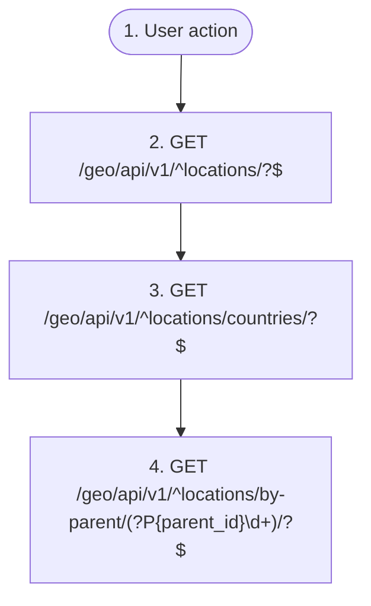

# Browse the location tree

`geo.location_browse`

**Actors:** Any authenticated or anonymous user

A user drills into the hierarchical location reference (country -> region -> city) or searches it by name — picking a location for a listing, a profile, or a filter. Flat reference data: no geometry, each node is a point with a geohash.

## Flow diagram

## Steps

1. **User action** — The user opens a location picker or map filter
2. **GET `/geo/api/v1/^locations/?$`** — List root locations or search the tree by name
3. **GET `/geo/api/v1/^locations/countries/?$`** — Fetch the root level (countries)
4. **GET `/geo/api/v1/^locations/by-parent/(?P<parent_id>\d+)/?$`** — Drill into a node's children

## Endpoints

| Step | Method | Path | Request | Response | Step-up verification |
|---|---|---|---|---|---|
| 2 | GET | `/geo/api/v1/^locations/?$` | — | LocationSerializer | — |
| 2 | GET | `/geo/api/v1/^locations/?\.(?P<format>[a-z0-9]+)/?$` | — | LocationSerializer | — |
| 3 | GET | `/geo/api/v1/^locations/countries/?$` | — | LocationSerializer | — |
| 3 | GET | `/geo/api/v1/^locations/countries/?\.(?P<format>[a-z0-9]+)/?$` | — | LocationSerializer | — |
| 4 | GET | `/geo/api/v1/^locations/by-parent/(?P<parent_id>\d+)/?$` | — | LocationSerializer | — |
| 4 | GET | `/geo/api/v1/^locations/by-parent/(?P<parent_id>\d+)/?\.(?P<format>[a-z0-9]+)/?$` | — | LocationSerializer | — |
