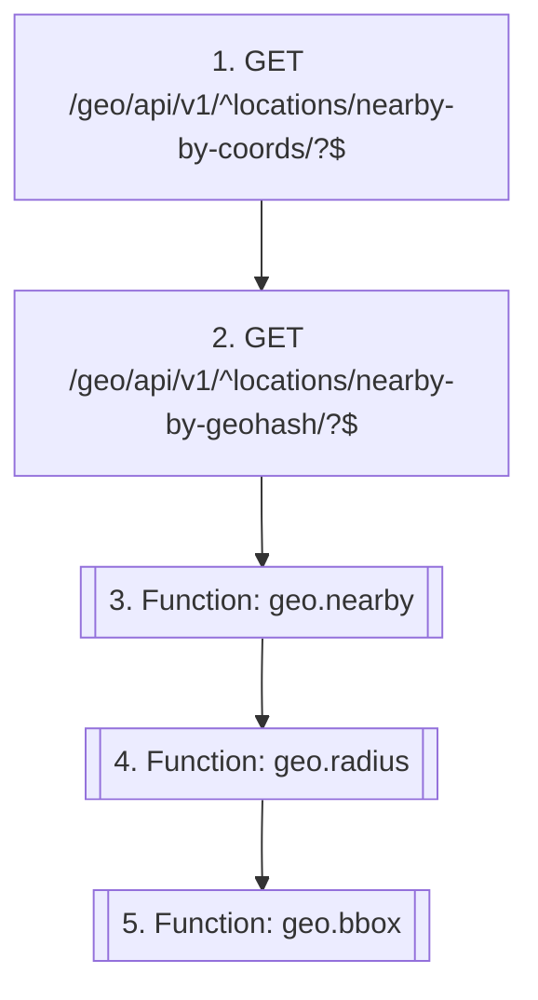

# Find locations near a point

`geo.location_nearby`

**Actors:** Any user, Consumer modules via comm

A consumer (listings' radius filter, a 'near me' UI) asks which known locations are nearest to a coordinate or geohash. Served by the swappable search backend (STAPEL_GEO['SEARCH_BACKEND']) — geohash prefix expansion over the primary DB by default, correct across the equator, the antimeridian and the poles.

## Flow diagram

## Steps

1. **GET `/geo/api/v1/^locations/nearby-by-coords/?$`** — Nearest locations to a coordinate (top-K, exact haversine)
2. **GET `/geo/api/v1/^locations/nearby-by-geohash/?$`** — Nearest locations to a geohash (decoded to its cell centre)
3. **Function `geo.nearby`** — Modules query top-K proximity by name over comm — never importing geo
4. **Function `geo.radius`** — Radius membership (everything within N km) for radius filters
5. **Function `geo.bbox`** — Rectangle membership for map-viewport queries (antimeridian-aware)

## Endpoints

| Step | Method | Path | Request | Response | Step-up verification |
|---|---|---|---|---|---|
| 1 | GET | `/geo/api/v1/^locations/nearby-by-coords/?$` | — | LocationSerializer | — |
| 1 | GET | `/geo/api/v1/^locations/nearby-by-coords/?\.(?P<format>[a-z0-9]+)/?$` | — | LocationSerializer | — |
| 2 | GET | `/geo/api/v1/^locations/nearby-by-geohash/?$` | — | LocationSerializer | — |
| 2 | GET | `/geo/api/v1/^locations/nearby-by-geohash/?\.(?P<format>[a-z0-9]+)/?$` | — | LocationSerializer | — |
