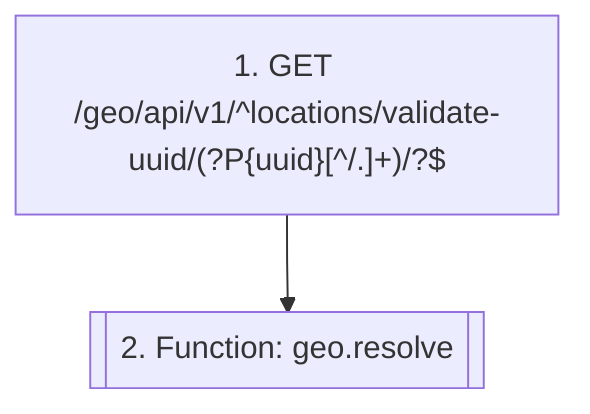

# Validate and expand a location reference

`geo.location_resolve`

**Actors:** Consumer modules via comm, Frontends

A module holding an opaque location UUID (a listing's location_id, a calendar address) checks it still exists and expands it to a display summary. A missing UUID is a normal answer, not an error.

## Flow diagram

## Steps

1. **GET `/geo/api/v1/^locations/validate-uuid/(?P<uuid>[^/.]+)/?$`** — Check a location UUID exists (malformed = valid: false)
2. **Function `geo.resolve`** — Modules resolve location UUIDs by name over comm

## Endpoints

| Step | Method | Path | Request | Response | Step-up verification |
|---|---|---|---|---|---|
| 1 | GET | `/geo/api/v1/^locations/validate-uuid/(?P<uuid>[^/.]+)/?$` | — | LocationSerializer | — |
| 1 | GET | `/geo/api/v1/^locations/validate-uuid/(?P<uuid>[^/.]+)/?\.(?P<format>[a-z0-9]+)/?$` | — | LocationSerializer | — |
