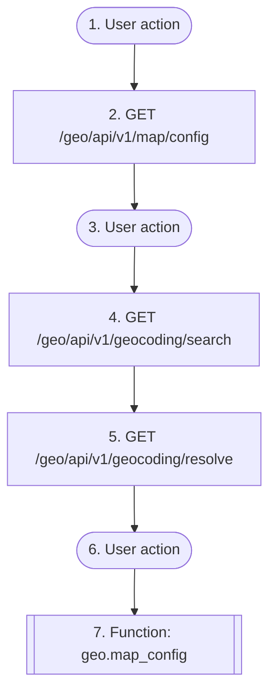

# Pick a location on a map

`geo.pick_location`

**Actors:** Any user, Frontends (geo-react)

A human chooses WHERE something is — a listing's address, a meeting point, a service area — by searching for it, by letting the browser report their position, or by dragging a pin. The library owns the whole round trip: the basemap's tile layer and its attribution obligations, the search-as-you-type discipline, and the single call that turns a coordinate into an address the user can confirm. A product that only offers raw latitude and longitude fields has not integrated this flow.

## Flow diagram

## Steps

1. **User action** — The user opens a composer and needs to say where
2. **GET `/geo/api/v1/map/config`** — The picker loads its tile layer, attribution and search discipline
3. **User action** — The user grants the browser's geolocation prompt, types an address, or drags the pin
4. **GET `/geo/api/v1/geocoding/search`** — Search-as-you-type, biased to the map's own viewport
5. **GET `/geo/api/v1/geocoding/resolve`** — The detected position (or the dropped pin) becomes an address to confirm
6. **User action** — The user confirms the address shown back, or picks one of the alternatives
7. **Function `geo.map_config`** — Server-rendered hosts read the same picker configuration by name

## Endpoints

| Step | Method | Path | Request | Response | Step-up verification |
|---|---|---|---|---|---|
| 2 | GET | `/geo/api/v1/map/config` | — | MapConfigSerializer | — |
| 4 | GET | `/geo/api/v1/geocoding/search` | — | GeocodeResponseSerializer | — |
| 5 | GET | `/geo/api/v1/geocoding/resolve` | — | PlaceResolutionSerializer | — |
